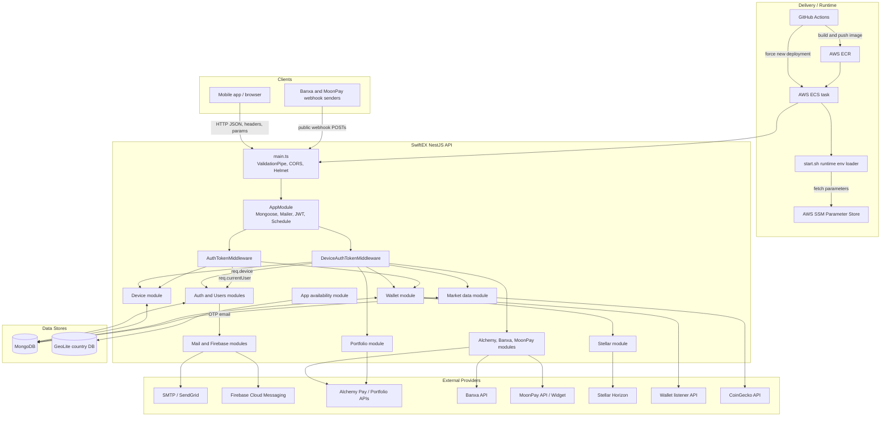

# SwiftEX Server Security Architecture

Date: 2026-07-19

Scope: architecture view of the NestJS API in this repository, based on static review of source code and deployment artifacts. Infrastructure controls that are not defined in this repository, such as TLS termination, WAF rules, API gateway throttling, MongoDB firewall rules, IAM trust policy conditions, and provider dashboard settings, are treated as external assumptions.

Related document: `docs/security/threat-model.md`.

## System Context

SwiftEX Server is a NestJS API for mobile/client workflows around user authentication, device registration, wallet management, crypto ramp provider integrations, market data, portfolio lookup, app availability, email OTPs, and push notifications.

At runtime, the API receives HTTP requests from clients and external webhook senders, enriches selected requests with device and user identities through middleware, persists application state in MongoDB, calls third-party providers, and sends email or Firebase notifications.

## Architecture Diagram

## Runtime Components

| Component | Responsibility | Main code | Key security concern |
|---|---|---|---|
| HTTP bootstrap | Creates Nest app, enables global validation, CORS, and Helmet | `src/main.ts` | CORS currently allows `origin: '*'`; validation strips extra fields but does not forbid them. |
| App module | Registers MongoDB, mailer, JWT, schedule, API modules, and middleware exclusions | `src/app.module.ts` | Authorization policy is encoded through middleware exclusion lists, which are hard to audit and currently contain route drift. |
| Device middleware | Reads `x-auth-device-token`, decodes token payload, loads device from MongoDB, assigns `req.device` | `src/common/middleware/device-auth-token-middleware.ts` | Uses `jwtService.decode`, so token signature and expiry are not enforced. |
| User middleware | Reads bearer token, decodes token payload, loads user from MongoDB, assigns `req.currentUser` | `src/common/middleware/auth-token.middleware.ts` | Uses `jwtService.decode`, so token signature and expiry are not enforced. |
| Auth/users | Signup, login, OTP verification, password reset, user profile operations | `src/api/v1/auth`, `src/api/v1/users` | OTPs are plaintext, not attempt-limited, and recovery endpoints reveal account existence. |
| Device | Device registration, FCM token update, device-user binding | `src/api/v1/device` | Public registration accepts device metadata and returns device JWTs; device identifiers and FCM tokens are sensitive. |
| Wallet/Stellar | Wallet persistence, listener sync, user assignment, Stellar activation XDR generation | `src/api/v1/wallet`, `src/api/v1/stellar` | Some financial flows are device-only; wallet ownership and activation signing need stronger policy gates. |
| Ramp providers | Alchemy, Banxa, and MoonPay quote/order/link flows | `src/api/v1/alchemy`, `src/api/v1/banxa`, `src/api/v1/moonpay` | Server-side provider credentials can be consumed through device-authenticated routes; webhook verification is missing or unused. |
| Market/portfolio | CoinGecko market ingestion, cached market data, Alchemy portfolio lookup | `src/api/v1/market-data`, `src/api/v1/portfolio` | Provider calls lack consistent timeouts/quotas; portfolio lookup by arbitrary address is privacy-sensitive. |
| App availability | Country restriction lookup and maintenance response | `src/api/v1/app-available` | Trusts client-controlled `x-forwarded-for` unless proxy controls are enforced outside this repo. |
| Mail/Firebase | Email OTPs and push notifications | `src/api/v1/mail`, `src/api/v1/notification` | OTP context is logged; Firebase service-account JSON is tracked in source. |
| Deployment/startup | Docker build, GitHub OIDC deploy, ECS runtime SSM fetch | `.github/workflows/deploy.yml`, `Dockerfile`, `start.sh` | Runtime imports all parameters under a path; IAM and secret scope must be tightly constrained. |

## Module Responsibilities

| Module | External interfaces | Persistence | External dependencies |
|---|---|---|---|
| AuthModule | `/api/v1/auth/signup`, `/login`, `/verify-user`, `/resend-otp`, `/forgot-password`, `/reset-password` | Users, auth OTPs | Mail service, JWT |
| UsersModule | User profile/update routes | Users | None direct |
| DeviceModule | `/api/v1/device`, `/update-fcm-token`, `/update-user` | Devices | JWT, Firebase token input from client |
| WalletModule | `/api/v1/wallet/**` | Wallets, activated wallets, wallet sync failures | Listener API, Stellar service |
| StellarModule | Called by wallet activation | None direct | Stellar Horizon, funding secret |
| AlchemyModule | `/api/v1/alchemy/**` | None observed for order intent | Alchemy Pay, Alchemy portfolio API through portfolio module |
| BanxaModule | `/api/v1/banxa/**` | None observed for order/webhook event state | Banxa API, Firebase notifications |
| MoonPayModule | `/api/v1/moonpay/**` | None observed for quote/link/webhook state | MoonPay API/widget |
| MarketDataModule | `/api/v1/market-data`, scheduled cron | Market data | CoinGecko |
| PortfolioModule | `/api/v1/portfolio/:address` | None observed | Alchemy portfolio API |
| AppAvailableModule | `/api/v1/app-available` | Restricted countries JSON/local GeoLite data | Request IP / forwarded headers |
| MailModule | Internal service | None observed | SMTP/Gmail/SendGrid |
| NotificationModule | Internal service | Device FCM token source | Firebase Admin SDK |

## Security Zones

| Zone | Assets | Entry points | Expected controls |
|---|---|---|---|
| Public internet | Client requests, webhook requests, client IP metadata | All HTTP routes | TLS at edge, CORS allowlist, request size limits, WAF/API gateway throttling, route inventory. |
| Device-authenticated API | Device metadata, FCM tokens, wallet/provider workflows | Routes requiring `x-auth-device-token` | Verified JWT, token expiry, replay controls, rate limits, device lifecycle audit. |
| User-authenticated API | User PII, user-wallet mappings, account changes | Routes requiring `Authorization: Bearer ...` | Verified JWT, email verification, ownership checks, response DTOs, audit logs. |
| Financial/provider workflows | Wallet addresses, signed ramp URLs, provider credentials, order metadata | Wallet, Alchemy, Banxa, MoonPay, Stellar endpoints | User auth for financial actions, policy validation, order persistence, webhook verification, quotas. |
| Internal persistence | MongoDB collections | Mongoose repositories/services | Private network access, least-privilege credentials, encryption at rest, backups, schema validation. |
| Notification and email | OTPs, recipients, FCM tokens, Firebase credential | Mail/Firebase services | Secret manager, credential rotation, redacted logs, send quotas, durable notification events. |
| Deployment and secrets | Docker image, SSM parameters, IAM role, runtime `.env` | GitHub Actions, ECS startup | Protected branches/environments, OIDC trust constraints, least privilege, secret scanning, config validation. |

## Trust Boundaries

| ID | Boundary | Description | Data crossing |
|---|---|---|---|
| TB-01 | Client to API | Public network callers submit HTTP requests to the NestJS listener. | Headers, JSON bodies, params, query strings. |
| TB-02 | Forwarded IP attribution | App availability logic derives country from `x-forwarded-for` or socket IP. | Client IP, forwarded chain, country result. |
| TB-03 | Device token identity | Device token creates `req.device` identity for downstream routes. | Device JWT payload, MongoDB device record. |
| TB-04 | User token identity | User token creates `req.currentUser` identity for downstream routes. | User JWT payload, MongoDB user record. |
| TB-05 | API to MongoDB | Services store and read users, OTPs, devices, wallets, activated wallets, sync failures, and market data. | PII, password hashes, OTPs, device IDs, FCM tokens, wallet mappings. |
| TB-06 | API to email provider | OTP email payloads leave the service. | Email, full name, OTP, purpose. |
| TB-07 | API to Firebase | Notification service uses Firebase Admin credential and FCM tokens. | Service-account credential, FCM token, notification body. |
| TB-08 | API to ramp providers | Server signs or sends requests to Alchemy, Banxa, and MoonPay. | API keys/secrets, amounts, wallet addresses, signed URLs, order data. |
| TB-09 | Provider webhook to API | Webhook routes receive provider-originated status events. | Order event, transaction ID, status, signature header. |
| TB-10 | API to Stellar Horizon | Wallet activation builds source-signed XDR using Stellar funding secret. | Funding secret, destination address, signed XDR. |
| TB-11 | API to listener service | Wallet service syncs addresses to listener API. | Listener bearer token, device ID, wallet addresses. |
| TB-12 | Scheduler to market data provider | Cron fetches market data and upserts MongoDB. | CoinGecko feed, transformed market records. |
| TB-13 | CI/CD to AWS runtime | GitHub Actions builds/deploys ECS image and ECS loads SSM parameters. | Docker image, IAM role, SSM parameters, runtime env vars. |

## Key Security Assumptions

| Assumption | Why it matters |
|---|---|
| TLS is terminated before requests reach the NestJS app. | The repo does not configure HTTPS directly. |
| A load balancer or API gateway controls trusted forwarded headers. | App availability currently reads `x-forwarded-for`; spoofing risk depends on edge configuration. |
| MongoDB is not publicly reachable and uses strong credentials. | MongoDB stores PII, password hashes, device identifiers, wallet mappings, OTPs, and market data. |
| AWS OIDC trust policy is restricted to the intended repository, branches, and environments. | The workflow assumes `arn:aws:iam::542005048192:role/github-ecr-role`; trust conditions are not visible in source. |
| Provider webhook secrets/IP allowlists exist outside the repo. | The current webhook controllers do not consistently verify authenticity. |
| Runtime secrets in SSM are scoped per environment and not shared broadly. | `start.sh` imports all parameters under a configurable path into `/app/.env`. |

## Architecture Risks To Address First

| Risk | Why it is architectural |
|---|---|
| Middleware decodes JWTs instead of verifying them. | Identity is a cross-cutting boundary for almost every protected route. |
| Financial flows are protected inconsistently. | Route exclusions make device-only access possible for wallet activation and provider order creation. |
| Provider webhooks are public without effective signature verification. | Webhook authenticity should be part of the integration boundary, not business logic after the fact. |
| No centralized abuse controls. | OTP, quote, order, webhook, portfolio, and activation flows can consume external provider resources. |
| Secrets and notification credentials are not fully externalized. | A tracked Firebase key and broad SSM import expand deployment and runtime blast radius. |
