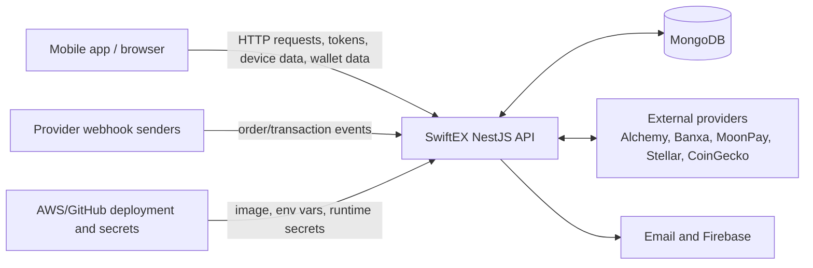
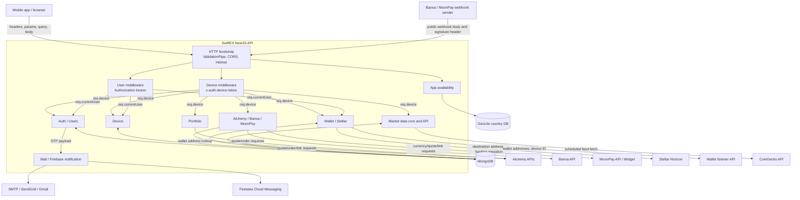

# SwiftEX Server Data Flow

Date: 2026-07-19

Scope: data movement for the NestJS API in this repository. This document separates the data-flow view from the STRIDE threat model in `docs/security/threat-model.md`.

## Level-0 Data Flow Diagram

## Level-1 Data Flow Diagram

## Data Stores

| Store | Data classes | Producer | Consumer |
|---|---|---|---|
| Users collection | Email, names, password hash, verification state, user profile fields | Auth/users services | Auth middleware, auth service, users service, wallet assignment |
| Auth OTP collection | Email, OTP, TTL timestamp | Auth service | Auth verification and password reset |
| Devices collection | Device unique ID, MAC, brand/model, FCM token, user binding, timestamps | Device service | Device middleware, wallet/ramp flows, notification service |
| Wallets collection | Wallet addresses by chain, Stellar address, user ID, device ID | Wallet service | Wallet queries, assignment, activation, listener sync |
| Activated wallets collection | Stellar address and device activation tracking | Wallet service | Wallet activation guard |
| Wallet sync failures collection | Device/user identifier, wallet addresses, sync error | Wallet service | Operational reconciliation |
| Market data collection | Coin metadata, price, market cap, volume, update timestamps | Market cron | Market data API |
| Restricted countries JSON / GeoLite DB | Country restrictions and IP country lookup | Static files/local DB | App availability service |
| Runtime `.env` | SSM-derived configuration and secrets | `start.sh` | NestJS modules and provider clients |

## Primary Data Flows

| ID | Flow | Source to destination | Data crossing | Trust boundaries | Main risk |
|---|---|---|---|---|---|
| DF-01 | Device registration | Client -> Device controller -> MongoDB -> client | Device unique ID, MAC, brand/model, FCM token, device JWT | TB-01, TB-05, TB-03 | Public device creation can be abused and device identifiers are sensitive. |
| DF-02 | Device token hydration | Client -> Device middleware -> MongoDB -> `req.device` | `x-auth-device-token`, decoded device ID, device record | TB-03, TB-05 | Token is decoded rather than verified, so forged payloads can select device records. |
| DF-03 | Signup and email verification | Client -> Auth service -> MongoDB -> Mail service -> email provider -> client | Email, password, password hash, OTP, verification JWT | TB-01, TB-03, TB-05, TB-06 | OTP is plaintext and logged through mail context; request volume is not rate-limited. |
| DF-04 | Login and user token hydration | Client -> Auth service -> client -> User middleware -> MongoDB -> `req.currentUser` | Email/password, JWT, decoded user ID, user record | TB-01, TB-04, TB-05 | User token signature and expiry are not enforced in middleware. |
| DF-05 | Password reset | Client -> Auth service -> OTP store -> Mail service -> Users collection | Email, OTP, new password, password hash | TB-01, TB-03, TB-05, TB-06 | Account existence is disclosed and OTP attempts are not bounded. |
| DF-06 | Device-user binding and FCM update | Client -> Device service -> MongoDB | Device token, user token, FCM token, user ID/device ID relation | TB-03, TB-04, TB-05 | Forged device token can alter notification routing or bind wrong device. |
| DF-07 | Wallet creation and listener sync | Client -> Wallet service -> MongoDB -> Listener API | Wallet addresses, optional user ID, device ID, listener bearer token | TB-01, TB-03, TB-05, TB-11 | Client can submit arbitrary `userId`; listener sync depends on weak device identity. |
| DF-08 | Wallet query and assignment | Client -> Wallet service -> MongoDB -> client | Wallet address params, user/device IDs, wallet records | TB-01, TB-03, TB-04, TB-05 | Ownership checks depend on decoded token identity and some routes are device-only. |
| DF-09 | Stellar activation | Client -> Wallet service -> Stellar service -> Stellar Horizon -> client | Stellar address, source funding secret, signed XDR | TB-01, TB-03, TB-05, TB-10 | Device-only route can cause source-signed activation XDR generation. |
| DF-10 | Alchemy quote/order flow | Client -> Alchemy service -> Alchemy Pay -> client | Amounts, currencies, networks, wallet address, signed provider URL | TB-01, TB-03, TB-08 | Server signs provider requests without strong user auth/policy persistence. |
| DF-11 | Banxa quote/order flow | Client -> Banxa service -> Banxa API -> client | Amounts, assets, wallet address, payment method, external order/customer IDs | TB-01, TB-03, TB-08 | Device ID is reused as external order/customer ID; order intent is not persisted. |
| DF-12 | Banxa webhook notification | Banxa webhook sender -> public controller -> notification service -> Firebase | Webhook body, external ID, order status, FCM token, notification payload | TB-09, TB-07, TB-05 | Public webhook lacks signature verification and durable event state. |
| DF-13 | MoonPay currency/quote/link flow | Client -> MoonPay service -> MoonPay API/widget -> client | Side, currency code, amount, fiat, wallet address, signed widget URL | TB-01, TB-03, TB-08 | Signed links are generated for client-supplied wallets without ownership/limit checks. |
| DF-14 | MoonPay webhook | MoonPay webhook sender -> public controller -> response | Webhook body, `moonpay-signature-v2` header | TB-09 | Controller currently ignores the signature verification helper. |
| DF-15 | Market data ingestion | Cron -> CoinGecko -> Market service -> MongoDB -> client | Market feed, transformed price records | TB-12, TB-05, TB-01 | Cron trusts provider response and updates cache without ingestion audit. |
| DF-16 | Portfolio lookup | Client -> Portfolio service -> Alchemy portfolio API -> client | Wallet address, token balances, prices/holdings | TB-01, TB-03, TB-08 | Arbitrary address aggregation is privacy-sensitive and consumes server API key. |
| DF-17 | App availability lookup | Client -> App availability service -> GeoLite DB -> client | `x-forwarded-for`, request IP, country, restricted flag | TB-01, TB-02 | Forwarded IP can be spoofed unless controlled by trusted proxy configuration. |
| DF-18 | Runtime secrets and deployment | GitHub Actions -> ECR/ECS; ECS -> SSM -> `/app/.env` -> Nest app | Image tag, IAM role, SSM parameters, provider secrets, JWT secret | TB-13 | Broad SSM path import and unknown IAM trust conditions affect runtime integrity. |

## Sensitive Data Classes

| Data class | Examples | Must be protected from |
|---|---|---|
| Authentication secrets | `JWT_SECRET`, user JWTs, device JWTs | Forgery, replay, logging, weak expiry enforcement. |
| Credentials and recovery material | Password hashes, OTPs, email provider credentials | Offline cracking, account takeover, log exposure, brute force. |
| Device identifiers | Unique device IDs, MAC address, model, FCM token | Tracking, notification hijack, device impersonation. |
| User PII | Email, first/last name, profile data | Excessive response exposure, logs, unauthorized lookup. |
| Wallet and financial metadata | Wallet addresses, user-device-wallet mapping, portfolio holdings, signed URLs | Ownership tampering, financial privacy exposure, provider abuse. |
| Blockchain signing authority | Stellar funding secret, source-signed XDR | Fund drain, unauthorized transaction generation. |
| Provider secrets | Alchemy/Banxa/MoonPay API keys/secrets, webhook secrets | Fraudulent order signing, webhook spoofing, quota abuse. |
| Cloud/admin credentials | Firebase service-account JSON, AWS OIDC role, SSM parameters | Project compromise, unauthorized deployment, secret disclosure. |

## Flow-Specific Security Controls

| Flow group | Current control in repo | Required control |
|---|---|---|
| Device/user identity | Middleware loads database records from token payloads. | Verify JWT signature/expiry/issuer/audience before database lookup; centralize as guards. |
| DTO validation | Global `ValidationPipe({ whitelist: true })`. | Add `forbidNonWhitelisted`, DTOs for every body/query/param, response DTOs, webhook schemas. |
| OTP flows | OTP TTL index and email delivery. | Hash OTPs, bind purpose, rate-limit by email/device/IP, attempt counters, single-use invalidation. |
| Wallet flows | Device ID is attached to wallet and used in queries. | Derive user from verified session, validate chain addresses, enforce ownership and idempotency. |
| Provider order/link signing | Provider keys remain server-side. | Require user auth/policy checks, persist order intent, validate currencies/amounts/wallet ownership. |
| Webhooks | Public routes return success; MoonPay signature helper exists but is unused. | Raw body verification, signature/timestamp/replay checks, event store, idempotent state transition. |
| External HTTP calls | Some quote routes use a Bottleneck queue. | Timeouts, retry/backoff, bounded queues, per-actor quotas, circuit breakers. |
| Logs | Nest/console logs throughout services. | Structured logs with redaction for OTP, tokens, provider URLs, wallet addresses, and PII. |
| Deployment secrets | Runtime SSM fetch into `.env`; GitHub OIDC. | Least-privilege SSM path allowlist, config schema validation, protected environments, secret scanning. |

## Data Retention And Audit Needs

| Data/event | Suggested retention intent |
|---|---|
| Auth events | Keep security audit records for signup, login success/failure, OTP send/verify, reset, and password change. |
| Device events | Keep device registration, FCM update, and user binding events with actor/IP/user agent and hashed identifiers. |
| Wallet events | Keep wallet create/delete/assign/activation intent, outcome, and listener sync status. |
| Provider events | Keep order intent, request hash, provider response ID, webhook event ID, signature verification result, state transition, and notification outcome. |
| Market ingestion | Keep ingestion run ID, source URL, response hash, item count, latency, error state, and previous-good marker. |
| Deployment events | Keep image digest, git SHA, environment approval, SSM config version, and ECS deployment ID. |
