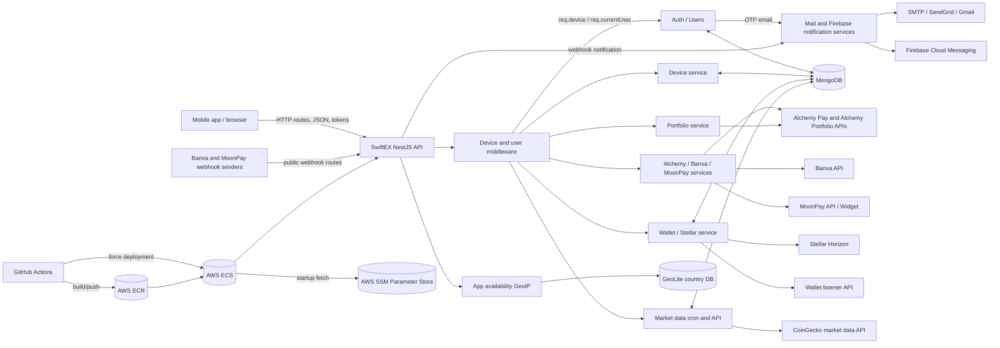

# SwiftEX Server STRIDE Threat Model

Date: 2026-07-13

Scope: static review of the NestJS API in this repository. Infrastructure outside the repository, provider dashboards, IAM trust policies, MongoDB network controls, WAF/API gateway settings, TLS termination, and production runtime logs were not available and are treated as assumptions.

Primary code reviewed:

- `src/main.ts`, `src/app.module.ts`
- `src/common/middleware/auth-token.middleware.ts`
- `src/common/middleware/device-auth-token-middleware.ts`
- `src/api/v1/**`
- `Dockerfile`, `start.sh`, `.github/workflows/deploy.yml`

## Architecture Summary

SwiftEX Server is a NestJS 11 API that serves mobile/client requests for authentication, device registration, wallets, crypto ramp provider flows, portfolio lookup, market data, app availability, email OTP, and push notification workflows.

Runtime components:

| Component | Responsibility | Main code |
|---|---|---|
| NestJS HTTP API | Routes, validation, CORS, Helmet, middleware | `src/main.ts`, `src/app.module.ts` |
| Device authentication middleware | Loads device from `x-auth-device-token` | `src/common/middleware/device-auth-token-middleware.ts` |
| User authentication middleware | Loads user from `Authorization: Bearer ...` | `src/common/middleware/auth-token.middleware.ts` |
| Auth and users | Signup, login, OTP verification, password reset, profile update | `src/api/v1/auth`, `src/api/v1/users` |
| Device management | Device registration, FCM token updates, user-device binding | `src/api/v1/device` |
| Wallet and Stellar | Wallet address storage, listener sync, Stellar activation XDR generation | `src/api/v1/wallet`, `src/api/v1/stellar` |
| Ramp providers | Alchemy Pay, Banxa, MoonPay quotes/order-link/webhook flows | `src/api/v1/alchemy`, `src/api/v1/banxa`, `src/api/v1/moonpay` |
| Market/portfolio | Scheduled CoinGecko ingestion, Alchemy portfolio lookup | `src/api/v1/market-data`, `src/api/v1/portfolio` |
| App availability | GeoIP country restriction and maintenance flag | `src/api/v1/app-available` |
| Email/notification | OTP email through SMTP/SendGrid, Firebase Cloud Messaging | `src/api/v1/mail`, `src/api/v1/notification` |
| MongoDB | Users, OTPs, devices, wallets, activated wallets, market data, sync failures | Mongoose schemas under `src/api/v1/*/schema` |
| Deployment | Docker image, SSM parameter fetch, ECR/ECS deployment | `Dockerfile`, `start.sh`, `.github/workflows/deploy.yml` |

Observed security controls:

- Global `ValidationPipe({ whitelist: true })` strips non-DTO body fields where DTO validation is used.
- `helmet()` is enabled.
- Passwords are hashed with bcrypt using configurable salt rounds.
- OTP documents have a TTL index of 600 seconds.
- JWT module is configured with a secret, expiry, and `ignoreExpiration: false`.
- Provider outbound signing exists for Alchemy Pay and MoonPay widget URLs.
- Docker runner uses a non-root `nestjs` user.
- CI uses GitHub OIDC to assume an AWS role instead of static AWS keys.

Important security gaps found in code:

- User and device middleware call `jwtService.decode(...)`, not `verify(...)`; signatures and expiry are not enforced at request time.
- CORS allows `origin: '*'`.
- No global rate limiting, request-size limits, brute-force controls, or per-user/provider quotas are present.
- Banxa webhook has no signature/authentication check.
- MoonPay webhook controller receives the signature header but does not call the existing `parseWebhook`/`verifyWebhook` logic.
- A Firebase Admin SDK service-account JSON file is tracked in the repository at `src/api/v1/notification/firebase/proxy-server-99cc2-firebase-adminsdk-oheag-108807e62a.json`.
- Mail service logs the email message object, including template context used for OTP emails.
- App availability trusts client-supplied `x-forwarded-for`.
- Several provider/wallet/order endpoints are excluded from user JWT auth and depend only on the device token boundary.

## Entry Points

Auth requirement is based on the middleware exclusions in `src/app.module.ts`.

Legend:

- Public: excluded from both device and user middleware.
- Device: requires `x-auth-device-token`.
- User: requires `Authorization` user token.
- Device + user: both middleware run.
- Note: token middleware currently decodes tokens without signature/expiry verification.

| Method | Path | Auth boundary in code | Primary input | Primary action |
|---|---|---|---|---|
| GET | `/` | Device + user | Headers | Health-like hello response |
| GET | `/health` | Public | None | Returns status, timestamp, uptime |
| GET | `/api/v1/app-available/` | Public | `x-forwarded-for` or request IP | GeoIP restriction and maintenance flag |
| POST | `/api/v1/auth/signup` | Device | Email/password body | Create user and send OTP |
| POST | `/api/v1/auth/login` | Device | Username/password body | Local auth, issue JWT for verified users |
| POST | `/api/v1/auth/verify-user` | Device | Email/OTP body | Verify email, issue JWT |
| POST | `/api/v1/auth/resend-otp` | Device | Email body | Send new verification OTP |
| POST | `/api/v1/auth/forgot-password` | Device | Email body | Send password reset OTP |
| POST | `/api/v1/auth/reset-password` | Device | Email/OTP/password body | Reset password |
| POST | `/api/v1/device` | Public | Device metadata, unique ID, MAC, FCM token | Create/update device and return device JWT |
| PATCH | `/api/v1/device/update-fcm-token` | Device | FCM token body | Update current device FCM token |
| PATCH | `/api/v1/device/update-user` | Device + user | Headers | Link current device to current user |
| POST | `/api/v1/wallet` | Device | Wallet addresses, optional user ID | Store wallet for device, sync listener in prod |
| DELETE | `/api/v1/wallet/delete` | Device | Wallet addresses | Remove wallet from listener |
| GET | `/api/v1/wallet/:chain/address/:walletAddress` | Device | Chain and address params | Find device wallet by address |
| GET | `/api/v1/wallet/:stellarAddress/stellar` | Device + user | Stellar address param | Find device wallet by Stellar address |
| GET | `/api/v1/wallet/user/` | Device + user | Headers | Find wallets for current user/device |
| PATCH | `/api/v1/wallet/:stellarAddress/assign-user` | Device + user | Stellar address param | Assign wallet to current user |
| PATCH | `/api/v1/wallet/:stellarAddress/activate-wallet` | Device | Stellar address param | Build signed Stellar activation XDR |
| POST | `/api/v1/alchemy/fetch-quotes` | Device | Quote body | Signed Alchemy Pay quote request |
| POST | `/api/v1/alchemy/create-buy-order` | Device | Order body | Build signed Alchemy buy URL |
| POST | `/api/v1/alchemy/create-sell-order` | Device | Order body | Build signed Alchemy sell URL |
| GET | `/api/v1/banxa/fetch-assets` | Device | Query order type | Fetch Banxa assets/payment methods |
| POST | `/api/v1/banxa/fetch-quotes` | Device | Quote body | Banxa quote request |
| POST | `/api/v1/banxa/create-buy-order` | Device | Order body | Banxa buy order request |
| POST | `/api/v1/banxa/create-sell-order` | Device | Order body | Banxa sell order request |
| POST | `/api/v1/banxa/banxa` | Public | Webhook body | Send FCM order notification |
| GET | `/api/v1/market-data` | Device | Headers | Return all cached market data |
| GET | `/api/v1/portfolio/:address` | Device | Wallet address param | Alchemy portfolio lookup |
| POST | `/api/v1/moonpay/currencies` | Device | Side body | Fetch supported MoonPay currencies |
| POST | `/api/v1/moonpay/quote` | Device | Side/code/amount/fiat body | Fetch MoonPay quote |
| POST | `/api/v1/moonpay/link` | Device | Side/code/amount/wallet body | Build signed MoonPay widget URL |
| POST | `/api/v1/moonpay/webhook` | Public | Webhook body, signature header | Currently returns `{ received: true }` |

Stale or inconsistent route inventory:

- Middleware exclusions reference `/api/v1/device/:uniqueId/unique-id`, `/api/v1/auth/send-otp`, and `/api/v1/auth/verify-otp`, but matching controllers were not found.
- `UsersController` defines two `@Put('')` handlers, so one route may shadow the other depending on Nest routing behavior.
- `WalletController.findByUser` uses `req.CurrentUser` while middleware sets `req.currentUser`, likely causing a runtime failure.

## Trust Boundaries

| ID | Boundary | Crosses from | Crosses to | Data crossing |
|---|---|---|---|---|
| TB-01 | Internet to API | Mobile app/browser/external callers | NestJS HTTP listener | Headers, params, query, JSON bodies |
| TB-02 | Proxy/IP attribution | Client/proxy/load balancer | App availability logic | `x-forwarded-for`, request IP |
| TB-03 | Device token boundary | Caller-provided `x-auth-device-token` | `req.device` identity | Device ID JWT payload |
| TB-04 | User token boundary | Caller-provided `Authorization` token | `req.currentUser` identity | User ID/email JWT payload |
| TB-05 | App to MongoDB | Nest services | MongoDB collections | Users, OTPs, devices, wallets, market data |
| TB-06 | App to email provider | Mail service | SMTP/SendGrid/Gmail | OTP email and recipient PII |
| TB-07 | App to Firebase | Notification service | Firebase Admin/FCM | Service-account credential, FCM tokens, notifications |
| TB-08 | App to ramp providers | Alchemy/Banxa/MoonPay services | Provider APIs/widgets | API keys, signed URLs, quotes, orders, wallet addresses |
| TB-09 | Provider webhook to app | Banxa/MoonPay webhooks | Public webhook routes | Order status events, external IDs, signatures |
| TB-10 | App to blockchain services | Stellar service | Stellar Horizon network | Funding secret, account destination, signed XDR |
| TB-11 | App to listener service | Wallet service | Listener API | Wallet addresses, device IDs, bearer token |
| TB-12 | Scheduler to market data | Cron worker | CoinGecko/API and MongoDB | Market data feed and bulk writes |
| TB-13 | Deployment/secrets | GitHub Actions/ECS container | AWS ECR/ECS/SSM/runtime env | Images, SSM parameters, IAM role, runtime `.env` |
| TB-14 | Source repository | Git repository/workstation | Build/runtime | Source code, committed service-account JSON, ignored local `.env` |

## Sensitive Assets

| Asset | Sensitivity | Location/flow | Main risk |
|---|---|---|---|
| `JWT_SECRET`, JWT expiry | Authentication secret | Env/SSM, `JwtModule` | Token forgery if leaked; currently not enforced by middleware verification |
| User PII | Personal data | Users collection, API responses, logs | Privacy breach, account targeting |
| Password hashes | Credential data | Users collection | Offline cracking if MongoDB leaks |
| OTP values | Account recovery/verification secret | Auth OTP collection, email context, logs | Account takeover and password reset abuse |
| Device IDs, unique IDs, MAC addresses | Device identity and tracking data | Device collection and tokens | Device impersonation, privacy risk |
| FCM tokens | Notification routing secret | Device collection, Firebase calls | Notification hijacking/spam |
| Wallet addresses and user/device mappings | Financial privacy data | Wallet collections, listener, providers | Portfolio deanonymization and ownership tampering |
| Stellar activation funding secret | Blockchain signing authority | Env var `ACTIVATE_STELLAR_ADDRESS` used as secret | Fund drain, unauthorized transaction signing |
| Signed Stellar activation XDR | Transaction artifact | Wallet activation response | Abuse of funding source if activation is not controlled |
| Provider API keys/secrets | Third-party account authority | Env vars for Alchemy, Banxa, MoonPay | Fraudulent signed requests/order links |
| Provider webhook secrets | Webhook authenticity | Env vars for MoonPay/Banxa if configured | Spoofed events if absent/not verified |
| Firebase service-account JSON | Cloud admin credential | Tracked JSON file in source tree | Firebase project compromise if valid |
| MongoDB connection string | Database credential | Env/SSM | Database compromise |
| Email/SendGrid/Gmail credentials | Messaging credential | Env/SSM | OTP interception/spam, domain reputation damage |
| Listener bearer token | Internal service credential | Env/SSM | Wallet listener tampering |
| AWS IAM/GitHub OIDC deploy role | Deployment authority | GitHub Actions workflow | Unauthorized image deploy/service update |
| Market data cache | Integrity-sensitive app data | MarketData collection | Incorrect prices/portfolio display |

## Level-1 Data Flow Diagram

### Data Flows

| Flow | Description | Trust boundaries | Sensitive data |
|---|---|---|---|
| DF-01 | Device registration returns device JWT | TB-01, TB-03, TB-05 | Device identifiers, FCM token |
| DF-02 | Signup/login/OTP/password reset | TB-01, TB-03, TB-05, TB-06 | Email, password, password hash, OTP, JWT |
| DF-03 | User/device middleware hydrates request identities | TB-03, TB-04, TB-05 | Token payload IDs, user/device records |
| DF-04 | Wallet creation/query/assignment/activation | TB-01, TB-03, TB-04, TB-05, TB-10, TB-11 | Wallet addresses, user/device IDs, signed XDR |
| DF-05 | Alchemy/Banxa/MoonPay quotes and order links | TB-01, TB-03, TB-08 | API keys, signed URLs, amounts, wallet addresses |
| DF-06 | Banxa/MoonPay webhooks | TB-01, TB-09, TB-07 | Order status, external IDs, FCM notifications |
| DF-07 | Market data cron ingestion | TB-12, TB-05 | Market prices and metadata |
| DF-08 | Portfolio lookup by arbitrary address | TB-01, TB-03, TB-08 | Wallet address, token holdings/prices |
| DF-09 | App availability by IP | TB-01, TB-02 | Client IP, country, restriction flag |
| DF-10 | Runtime secret loading and deployment | TB-13, TB-14 | SSM params, env vars, image artifacts, IAM role |

## DREAD Scoring

Scores use 0 to 10 for:

- Dmg: damage potential
- Rep: reproducibility
- Exp: exploitability
- Aff: affected users/scope
- Disc: discoverability

Average severity:

| Average | Severity |
|---:|---|
| 8.0-10.0 | Critical |
| 6.0-7.9 | High |
| 4.0-5.9 | Medium |
| 0.0-3.9 | Low |

## STRIDE Threat Model

DREAD format: `Dmg/Rep/Exp/Aff/Disc = Avg Severity`.

| Component | STRIDE | Threat and gap | Existing mitigation | DREAD | OWASP API Top 10 2023 | Recommended mitigation |
|---|---|---|---|---|---|---|
| Global API/runtime | Spoofing | Open CORS allows any browser origin to call the API; API identity relies on bearer headers from any origin. | Helmet is enabled. | 6/8/8/8/7 = 7.4 High | API8 Security Misconfiguration | Restrict CORS to approved app/web origins; reject credentials from unknown origins; document allowed clients. |
| Global API/runtime | Tampering | DTO whitelist strips extra fields only where DTOs are used; raw webhook bodies and `any` payloads bypass structured validation. | Global `ValidationPipe({ whitelist: true })`. | 6/8/6/7/6 = 6.6 High | API3 Broken Object Property Level Authorization, API8 | Add `forbidNonWhitelisted: true`, DTOs for all inputs, payload schemas for webhooks, and validation for params/query. |
| Global API/runtime | Repudiation | Console logs are not durable audit logs; no request IDs, actor IDs, idempotency keys, or security event audit trail are present. | Nest `Logger` used in places. | 5/9/7/8/8 = 7.4 High | API10 Unsafe Consumption of APIs, API8 | Add structured audit logging with request ID, device ID, user ID, route, decision, provider order IDs, and immutable retention. |
| Global API/runtime | Information Disclosure | Provider errors and request objects are logged or returned in several services; exception handling may expose upstream details. | Password is excluded by normal user repository queries. | 7/7/6/7/7 = 6.8 High | API3, API8 | Centralize exception filters, scrub secrets/PII, disable verbose provider error echoing, and add log redaction. |
| Global API/runtime | Denial of Service | No rate limits, body-size limits, timeouts, circuit breakers, or global throttling; Axios configs use `maxBodyLength: Infinity`. | A Bottleneck queue exists for some quote endpoints only. | 8/9/8/8/8 = 8.2 Critical | API4 Unrestricted Resource Consumption | Add API gateway/WAF limits, Nest throttling, body limits, axios/fetch timeouts, provider quotas, and queue limits. |
| Global API/runtime | Elevation of Privilege | No role or scope model; route authorization depends on middleware exclusions and weak token identity. | Some routes require device and/or user middleware. | 9/9/9/9/9 = 9.0 Critical | API2 Broken Authentication, API5 Broken Function Level Authorization | Implement verified JWT guards, route metadata, scopes/roles, ownership checks, and integration tests for authorization matrix. |
| Auth/users | Spoofing | `AuthTokenMiddleware` decodes JWTs without verifying signature or expiry, so a forged token payload can impersonate any verified user ID. | JWTs are signed at login/verify-user; email verification is checked after user lookup. | 9/10/9/10/9 = 9.4 Critical | API2, API5 | Replace `decode` with `verifyAsync`; enforce issuer/audience/expiry; reject malformed bearer format; add tests for forged/expired tokens. |
| Auth/users | Tampering | `updateUser` merges a Mongoose user object with client DTO via `Object.assign`; duplicate `PUT /api/v1/users` handlers create ambiguous behavior. | Update DTO only exposes profile fields. | 5/7/6/6/6 = 6.0 High | API3, API5 | Split profile update and password-change routes; use explicit update objects; enable `forbidNonWhitelisted`; add route tests. |
| Auth/users | Repudiation | Signup, login, OTP verification, password reset, and password change lack durable security audit records. | Basic Nest logs. | 6/8/7/8/7 = 7.2 High | API8 | Log auth events with normalized outcome, actor, IP, device, and correlation ID; alert on anomalies. |
| Auth/users | Information Disclosure | `forgot-password`/`resend-otp` reveal whether a user exists; login/verify endpoints return user objects containing PII. | Password is excluded from normal `findOne` responses. | 6/8/7/7/8 = 7.2 High | API3 | Use uniform account recovery responses; minimize returned user fields; add response DTOs. |
| Auth/users | Denial of Service | No brute-force, OTP request, password reset, or login rate limits; OTP email can be abused to spam users and mail provider. | OTP TTL index expires records after 10 minutes. | 8/9/8/8/8 = 8.2 Critical | API4, API6 Unrestricted Access to Sensitive Business Flows | Add per-email, per-device, per-IP limits; CAPTCHA/risk checks; exponential backoff; account lockout alerts. |
| Auth/users | Elevation of Privilege | OTPs are 6-digit plaintext values with no attempt counter; password reset succeeds with email plus OTP only. | OTP TTL exists; passwords are bcrypt hashed. | 9/8/8/9/8 = 8.4 Critical | API2, API6 | Hash OTPs, enforce attempt limits, invalidate OTP after use, bind OTP purpose, and require stronger recovery controls. |
| Device management | Spoofing | `DeviceAuthTokenMiddleware` decodes device JWTs without verifying signature/expiry; public device creation accepts arbitrary unique ID and MAC address. | Device must exist in MongoDB after decoding. | 8/10/9/9/9 = 9.0 Critical | API2 | Verify device JWTs, rotate device tokens, bind token to device secret/public key, and validate device attestation where possible. |
| Device management | Tampering | A forged device token can update another device's FCM token or link a device to an attacker-controlled user. | Device lookup by `_id` is performed. | 7/9/8/8/8 = 8.0 Critical | API1 Broken Object Level Authorization, API2 | Enforce verified tokens and ownership; require re-auth for device-user binding; audit FCM token changes. |
| Device management | Repudiation | Device registration and FCM changes are not durably audited. | Timestamps on schema. | 5/8/7/7/7 = 6.8 High | API8 | Store device lifecycle events with actor/IP/user agent and previous/new FCM token hash. |
| Device management | Information Disclosure | Device records include MAC address, unique ID, model, brand, referral code, user ID, and FCM token; some endpoints return device objects. | None found for response shaping. | 7/7/6/8/7 = 7.0 High | API3 | Return response DTOs that omit FCM/MAC/internal IDs unless necessary; encrypt or hash high-risk identifiers. |
| Device management | Denial of Service | Public registration can create/update devices and store arbitrary FCM tokens without rate limits. | Unique ID lookup reuses existing device records. | 7/9/8/8/8 = 8.0 Critical | API4, API6 | Add registration quotas, device ID length checks, abuse detection, and database uniqueness constraints. |
| Device management | Elevation of Privilege | Many wallet/ramp/market routes require only device auth; forging a device token grants access to business flows without a user session. | Middleware attaches `req.device`. | 9/9/9/9/9 = 9.0 Critical | API2, API5, API6 | Require user auth for financial actions where appropriate; use verified device tokens plus user ownership policy. |
| Wallet/Stellar/listener | Spoofing | Wallet operations trust device identity; `POST /wallet` also accepts optional `userId` from the client and only checks that the user exists. | Device ID is attached to wallet; user existence is checked. | 8/9/8/9/8 = 8.4 Critical | API1, API2, API5 | Do not accept arbitrary `userId`; derive user from verified session; enforce wallet ownership checks on every operation. |
| Wallet/Stellar/listener | Tampering | Wallet creation validates address keys but not address values; listener delete uses request body and device ID without confirming stored wallet ownership. | `KeysFromEnum` validates map keys. | 8/8/7/8/7 = 7.6 High | API1, API3 | Validate chain-specific addresses, confirm wallet exists for current device/user before listener updates, and wrap DB/listener changes in compensating workflow. |
| Wallet/Stellar/listener | Repudiation | Wallet create/delete/assign/activate actions and listener sync failures lack durable business audit and idempotency. | Sync failures are stored in `WalletSyncFailed`. | 6/8/7/8/7 = 7.2 High | API8 | Add idempotency keys, event records, signed provider/listener request logs, and reconciliation jobs. |
| Wallet/Stellar/listener | Information Disclosure | Forged device/user tokens can query wallet ownership; logs include wallet DTOs and addresses. | Queries include device ID for some lookups. | 7/8/7/8/8 = 7.6 High | API1, API3 | Verify tokens, reduce logging of addresses, return minimal wallet data, and classify wallet-owner mapping as sensitive. |
| Wallet/Stellar/listener | Denial of Service | Activation can trigger Stellar Horizon calls and produce signed funding transactions; repeated calls can consume provider quota or drain activation funds if submitted. | Prevents multiple activated wallets per device/address in `ActivatedWallet`, but no create record is shown after XDR generation. | 9/8/8/8/8 = 8.2 Critical | API4, API6 | Rate-limit activation, record activation intent before signing, enforce funding budget, require user auth, and monitor source account. |
| Wallet/Stellar/listener | Elevation of Privilege | Forged user/device tokens can assign wallets to users; activation endpoint is user-auth excluded and returns a source-signed XDR. | Wallet must exist for device before activation. | 9/8/8/9/8 = 8.4 Critical | API1, API2, API5 | Require verified user for activation/assignment; verify device ownership; move signing behind policy checks and transaction state machine. |
| Alchemy integration | Spoofing | Alchemy order creation endpoints are user-auth excluded and rely on device identity; `req.currentUser` is passed but may be undefined. | Outbound Alchemy requests are HMAC-signed. | 7/8/8/8/8 = 7.8 High | API2, API5, API6 | Require verified user/session for order creation; bind orders to user/device and persist them before returning signed URLs. |
| Alchemy integration | Tampering | Client controls amount, fiat, crypto, network, and address; service signs/returns provider URLs without local business policy validation. | Basic DTO string validation and `side` enum for quotes. | 8/8/7/8/7 = 7.6 High | API3, API6 | Add allowlists for currencies/networks, amount limits, destination address validation, jurisdiction checks, and fraud rules. |
| Alchemy integration | Repudiation | Merchant order number is random and not persisted with user/device/request metadata. | Provider URL includes merchant order number. | 6/8/7/8/7 = 7.2 High | API8 | Persist order intent, signed parameters, actor, provider response, and idempotency key. |
| Alchemy integration | Information Disclosure | Signed provider URLs and error messages may expose order details; logs contain provider workflow markers. | No secret printed in normal signing logs. | 6/7/6/7/7 = 6.6 High | API3, API8 | Treat signed URLs as sensitive, avoid logging full URLs, and set short-lived signed order links where provider supports it. |
| Alchemy integration | Denial of Service | `fetch-quotes` uses a global Bottleneck queue with `maxConcurrent: 1`, enabling one caller to starve all quote users; outbound HTTP lacks timeout. | Bottleneck adds some backpressure. | 8/9/8/8/8 = 8.2 Critical | API4 | Use per-device/user rate limits, queue length limits, timeouts, circuit breakers, and cached quotes where possible. |
| Alchemy integration | Elevation of Privilege | Any caller with a valid or forged device token can make the server sign provider requests using server-side Alchemy credentials. | Provider credentials are server-side only. | 8/8/8/8/8 = 8.0 Critical | API2, API5, API6 | Require verified auth and policy checks before signing; scope provider credentials; monitor signed-request volume. |
| Banxa integration | Spoofing | Public Banxa webhook accepts arbitrary body without signature verification; attacker can spoof `external_id` and status. | Webhook returns HTTP 200; device lookup is required for notification. | 8/9/8/8/8 = 8.2 Critical | API2, API8, API10 | Verify Banxa webhook signatures/IP allowlist, reject unsigned events, and use replay protection/timestamps. |
| Banxa integration | Tampering | Buy/sell order body controls wallet, amount, payment method, crypto, blockchain; `externalOrderId` is reused as device ID, not unique per order. | Banxa API key is server-side; DTO validates strings. | 7/8/7/8/7 = 7.4 High | API3, API6 | Validate supported assets/payment methods, enforce amount limits, generate unique order IDs, persist orders, and bind to actor. |
| Banxa integration | Repudiation | Webhooks are not stored; notifications are sent without durable event record or provider signature evidence. | Logs are emitted. | 6/8/7/8/7 = 7.2 High | API8, API10 | Store webhook event ID, signature verification result, raw payload hash, order state transition, and notification outcome. |
| Banxa integration | Information Disclosure | `BanxaHttpService` returns provider response merged with request body, potentially echoing wallet addresses and order input. | None found for response minimization. | 6/8/6/7/7 = 6.8 High | API3 | Return a response DTO with only fields needed by the client; redact PII/payment metadata. |
| Banxa integration | Denial of Service | Quote/order/provider asset calls and public webhook notifications have no route-specific throttling or outbound timeouts. | Some quote route uses global queue. | 7/9/8/8/8 = 8.0 Critical | API4, API6 | Add provider-specific rate limits, webhook rate limits, timeouts, retries with backoff, and dead-letter queues. |
| Banxa integration | Elevation of Privilege | Forged device tokens can create orders using server Banxa credentials; spoofed webhooks can cause server-originated FCM notifications. | Device ID is used as external customer/order ID. | 8/8/8/8/8 = 8.0 Critical | API2, API5, API6 | Verify tokens, require user auth for orders, validate webhook authenticity, and decouple notification decisions from unauthenticated payloads. |
| MoonPay integration | Spoofing | Webhook controller ignores `moonpay-signature-v2` and does not call existing `verifyWebhook` logic. | `verifyWebhook` helper exists in library. | 8/9/8/8/8 = 8.2 Critical | API2, API8, API10 | Use raw body capture and `parseWebhook`; verify signature/timestamp; reject unauthenticated webhooks. |
| MoonPay integration | Tampering | Link generation signs arbitrary wallet address and amount for supported currencies without local ownership or limit checks. | `isSupported` checks currency support. | 7/8/7/8/7 = 7.4 High | API3, API6 | Validate wallet belongs to actor, enforce min/max amounts and jurisdiction/business policy, persist signed link requests. |
| MoonPay integration | Repudiation | Quote/link/webhook flows are not persisted, so disputes cannot be tied to an actor or exact signed parameters. | External transaction ID uses device ID. | 5/8/7/7/7 = 6.8 High | API8 | Use unique transaction IDs, store request/response hashes, actor IDs, and state transitions. |
| MoonPay integration | Information Disclosure | Controller logs full webhook body; quote helper logs provider quote body. | None found. | 6/8/7/7/8 = 7.2 High | API3, API8 | Remove raw body logs or redact sensitive fields; centralize structured logging. |
| MoonPay integration | Denial of Service | Currencies/quote/link endpoints call external services without route throttling, timeout, or cache controls beyond in-memory currency cache. | Currency list cache lasts five minutes. | 7/8/7/8/7 = 7.4 High | API4 | Add timeouts, per-device quotas, circuit breakers, and bounded caches. |
| MoonPay integration | Elevation of Privilege | Device-token forgery allows signing MoonPay widget URLs with server secret and chosen external transaction ID/device binding. | MoonPay secret remains server-side. | 8/8/8/8/8 = 8.0 Critical | API2, API5, API6 | Verify device token, require user session for financial flows, and generate unique external transaction IDs server-side. |
| Market data/portfolio | Spoofing | Portfolio lookup is user-auth excluded and accepts arbitrary address; callers can make the server query Alchemy with its API key. | Device token required. | 5/8/7/8/7 = 7.0 High | API2, API6 | Require verified device token and consider user auth/ownership for portfolio privacy; rate-limit by actor. |
| Market data/portfolio | Tampering | Market cron trusts external CoinGecko data and bulk writes it to MongoDB without source integrity checks or schema validation at ingestion time. | Data is transformed before write. | 6/7/6/7/6 = 6.4 High | API10 | Validate provider response schema, pin allowed fields, monitor anomalies, and retain previous known-good data. |
| Market data/portfolio | Repudiation | Market data updates do not store feed version, source response hash, or fetch status history. | `savedAt` timestamp exists. | 4/7/6/6/6 = 5.8 Medium | API8, API10 | Store ingestion run records, response hashes, status, count, and provider latency/errors. |
| Market data/portfolio | Information Disclosure | Arbitrary portfolio lookup exposes holdings/prices for any submitted blockchain address through the app. Blockchain data is public, but aggregation is privacy-sensitive. | Requires device token in code. | 6/8/7/7/7 = 7.0 High | API3, API6 | Rate-limit lookups, require ownership proof for private portfolio features, and avoid caching address queries with user identifiers unless needed. |
| Market data/portfolio | Denial of Service | `GET /market-data` returns all records; portfolio and cron fetches lack timeouts; cron runs every minute. | Market data is cached in MongoDB. | 7/8/7/8/7 = 7.4 High | API4 | Paginate market data, add provider timeouts, cache portfolio responses carefully, and tune cron/backoff. |
| Market data/portfolio | Elevation of Privilege | Server-side Alchemy portfolio API key can be consumed by any device-authenticated caller without business-flow checks. | API key is not exposed directly. | 5/8/7/7/7 = 6.8 High | API5, API6 | Add quotas, authorization policy, and provider-key usage monitoring. |
| App availability/GeoIP | Spoofing | `ClientIp` trusts `x-forwarded-for`; callers can spoof country unless a trusted proxy overwrites the header. | Falls back to request IP if header absent. | 6/9/8/8/8 = 7.8 High | API8 | Configure trusted proxy handling; only trust forwarded headers from known load balancers; otherwise use socket IP. |
| App availability/GeoIP | Tampering | Client-controlled IP header can alter `isRestricted` output and bypass client-side availability checks. | Restricted countries list is local JSON. | 5/9/8/8/8 = 7.6 High | API5, API8 | Enforce geo restrictions server-side on protected routes, not only via advisory app availability response. |
| App availability/GeoIP | Repudiation | IP-based decisions are unreliable if spoofed and not audited with trusted source metadata. | Logger emits IP in controller. | 5/8/7/7/7 = 6.8 High | API8 | Log trusted source IP, forwarded chain, proxy ID, and decision reason. |
| App availability/GeoIP | Information Disclosure | Endpoint exposes country, country name, restriction status, and maintenance state to unauthenticated callers. | Data is low sensitivity. | 3/9/8/7/8 = 7.0 High | API9 Improper Inventory Management | Keep response minimal; avoid exposing operational flags that help attackers time campaigns. |
| App availability/GeoIP | Denial of Service | Public endpoint performs GeoIP lookup and logs failures; no rate limit. | Local MaxMind DB lookup is used. | 5/8/7/7/7 = 6.8 High | API4 | Add route throttling and avoid expensive/error-heavy logging for invalid IP inputs. |
| App availability/GeoIP | Elevation of Privilege | If availability result is trusted by clients only, spoofed IP can bypass regional/business restrictions. | None found on downstream route enforcement. | 7/9/8/8/8 = 8.0 Critical | API5, API6, API8 | Enforce country restrictions at API gateway/service middleware for sensitive routes using trusted IP source. |
| Mail/Firebase notifications | Spoofing | Tracked Firebase service-account JSON may allow external senders to impersonate the app if the key is valid. | Firebase Admin initializes from service-account JSON. | 9/8/7/9/8 = 8.2 Critical | API8 | Revoke and rotate the committed key, remove from git history, load from secret manager, and restrict service-account IAM. |
| Mail/Firebase notifications | Tampering | FCM token is caller-controlled through device registration/update; a compromised/forged device token can reroute notifications. | FCM token stored on device record. | 7/8/8/8/8 = 7.8 High | API1, API2 | Verify device identity, audit FCM changes, use token freshness checks, and notify users on device notification changes. |
| Mail/Firebase notifications | Repudiation | Email and notification sends are not tied to durable event IDs or actor/request context. | Promise success/error is logged to console. | 5/8/7/7/7 = 6.8 High | API8 | Store notification/email event metadata, provider message ID, actor, template, and delivery status. |
| Mail/Firebase notifications | Information Disclosure | Mail service logs the full email message object, including OTP template context; Firebase errors may log token details. | None found. | 9/9/8/9/9 = 8.8 Critical | API3, API8 | Remove OTP/context logging, redact tokens/recipients, and add secret scanners to CI. |
| Mail/Firebase notifications | Denial of Service | OTP endpoints and spoofed webhooks can generate email/FCM traffic without throttling. | OTP TTL exists. | 7/9/8/8/8 = 8.0 Critical | API4, API6 | Rate-limit OTP and webhook-triggered notifications; add queue quotas and provider backoff. |
| Mail/Firebase notifications | Elevation of Privilege | A leaked Firebase Admin key can grant high-impact project-level messaging/admin capability depending on IAM. | Docker runs non-root, but credential is in source. | 9/8/7/9/8 = 8.2 Critical | API8 | Rotate credential, use workload identity or secret manager, least-privilege service account, and keyless auth where possible. |
| Persistence/secrets/deployment | Spoofing | Deployment authority relies on GitHub OIDC role; IAM trust policy was not in repo, so branch/environment constraints are unknown. | GitHub Actions uses OIDC rather than static keys. | 7/6/6/8/6 = 6.6 High | API8 | Restrict IAM role trust to exact repo, branch/environment, and workflow; require protected branches and approvals. |
| Persistence/secrets/deployment | Tampering | `start.sh` writes all SSM parameters under a path into `/app/.env`; compromised SSM path can fully control runtime configuration. | SSM fetch uses decryption and region. | 8/7/6/9/6 = 7.2 High | API8 | Use least-privilege SSM paths, parameter allowlist, config schema validation, and change alerts for security-critical params. |
| Persistence/secrets/deployment | Repudiation | Deploy workflow force-updates ECS on push without visible manual approval or deployment evidence beyond GitHub/AWS logs. | GitHub and AWS logs exist externally. | 6/7/6/8/6 = 6.6 High | API8 | Add environment protections, signed image provenance/SBOM, deployment approvals, and immutable release records. |
| Persistence/secrets/deployment | Information Disclosure | Firebase service-account JSON is tracked; local `.env` exists but is ignored and not tracked; runtime `.env` is created inside container. | `.gitignore` excludes `.env` and a differently named Firebase account file. | 9/8/7/9/8 = 8.2 Critical | API8 | Rotate exposed secrets, remove secret files from repo/history, expand `.gitignore` patterns, and enforce CI secret scanning. |
| Persistence/secrets/deployment | Denial of Service | Startup has `set -e`; SSM/AWS CLI failure can prevent app boot, and no config fallback/health distinction is present. | Fail-fast behavior avoids running with missing config. | 6/7/6/8/6 = 6.6 High | API4, API8 | Validate config before deploy, add readiness probes with clear failure modes, and monitor SSM dependency. |
| Persistence/secrets/deployment | Elevation of Privilege | Unknown AWS role scope plus ECS force-deploy could allow broader cloud changes if OIDC role is overprivileged. | Container runs as non-root. | 7/6/6/8/6 = 6.6 High | API8 | Apply least-privilege IAM for ECR push and ECS update only; separate build/deploy roles and environments. |

## OWASP API Top 10 Mapping

| OWASP category | Repository findings |
|---|---|
| API1: Broken Object Level Authorization | Wallet/device operations trust forged or weak device identity; FCM token changes and wallet lookups depend on object IDs from token payloads. |
| API2: Broken Authentication | User and device middleware decode JWTs instead of verifying signatures/expiry; OTP verification lacks attempt controls. |
| API3: Broken Object Property Level Authorization | Response bodies can expose full user/device/wallet/provider data; update flows should use explicit DTOs and response DTOs. |
| API4: Unrestricted Resource Consumption | No global throttling/body limits/timeouts; quote/order/webhook/OTP routes can drive provider, email, FCM, DB, and Stellar resource use. |
| API5: Broken Function Level Authorization | Many financial/provider routes are user-auth excluded; route policy is encoded through middleware exclusion lists rather than explicit guards. |
| API6: Unrestricted Access to Sensitive Business Flows | OTP, wallet activation, quote/order signing, portfolio lookup, and device registration lack abuse controls and business quotas. |
| API7: Server Side Request Forgery | Direct user-controlled URLs were not found; risk is lower because outbound hosts come from env, but compromised env/SSM could redirect provider/listener calls. |
| API8: Security Misconfiguration | Open CORS, weak token middleware, committed Firebase service account, webhook verification gaps, trusted `x-forwarded-for`, and broad runtime SSM import. |
| API9: Improper Inventory Management | Stale middleware route exclusions, README route drift, duplicate user routes, and unauthenticated operational endpoints indicate inventory drift. |
| API10: Unsafe Consumption of APIs | External provider responses/webhooks are trusted without consistent validation, signature verification, timeouts, or replay/idempotency controls. |

## Prioritized Mitigations

| Priority | Mitigation | Threats reduced |
|---|---|---|
| P0 | Replace all JWT `decode` calls in middleware with `verifyAsync`; enforce expiry, issuer/audience, and bearer format. | User/device spoofing, authorization bypass, EoP |
| P0 | Rotate and remove the committed Firebase service-account JSON; purge from git history and load credentials from secret manager/workload identity. | Secret disclosure, notification spoofing, cloud EoP |
| P0 | Verify Banxa and MoonPay webhooks with raw body, provider signatures, timestamp/replay checks, and event persistence. | Webhook spoofing/tampering/repudiation |
| P0 | Add global and route-specific rate limiting, request body limits, provider timeouts, queue limits, and brute-force/OTP controls. | DoS, OTP abuse, provider cost abuse |
| P0 | Require verified user auth and ownership checks for financial actions: wallet create/delete/assign/activate and provider order/link creation. | BOLA, BFLA, sensitive business flow abuse |
| P1 | Remove OTP/email/provider payload logging; add structured redaction for tokens, OTPs, wallet addresses, provider URLs, and PII. | Information disclosure, repudiation |
| P1 | Add DTOs and response DTOs for every route, including webhook payloads; enable `forbidNonWhitelisted` and validate params/query. | Tampering, mass assignment, excessive data exposure |
| P1 | Persist order intents, webhook events, wallet activation state, notification events, and external provider IDs with idempotency keys. | Repudiation, replay, inconsistent state |
| P1 | Validate chain-specific wallet addresses, supported currencies/networks, amounts, jurisdictions, and destination ownership before signing provider links. | Tampering, business logic abuse |
| P1 | Restrict CORS to approved origins and enforce trusted proxy configuration for IP attribution. | Spoofing, misconfiguration, geo bypass |
| P2 | Add deployment protections: secret scanning, SBOM/provenance, protected environments, least-privilege GitHub OIDC IAM, and config schema validation. | Supply chain, secrets, runtime tampering |
| P2 | Fix route drift and bugs: stale middleware exclusions, duplicate `PUT /users`, `req.CurrentUser`, missing controller routes mentioned in exclusions. | Inventory drift, DoS, authorization mistakes |
| P2 | Add monitoring and alerts for failed auth, OTP abuse, webhook verification failures, provider error rates, Stellar source balance, and anomalous order signing volume. | Detection, response, DoS, fraud |

## Open Questions

| Question | Security impact |
|---|---|
| Is there an API gateway/WAF/load balancer enforcing TLS, body limits, throttling, and trusted `x-forwarded-for`? | Could reduce or increase TB-01/TB-02 risk. |
| Are MongoDB, SMTP, Firebase, provider, and listener endpoints private-network restricted? | Determines blast radius of credential leakage. |
| What are the IAM permissions and trust conditions for `arn:aws:iam::542005048192:role/github-ecr-role`? | Determines deployment compromise impact. |
| Does Banxa provide webhook signatures or source IP allowlists configured in production? | Required to close webhook spoofing. |
| Should all ramp order creation require a verified user, or is anonymous device-only ordering intentional? | Defines correct authorization policy. |
| How is the Stellar activation source account funded and monitored? | Determines financial risk from activation abuse. |

